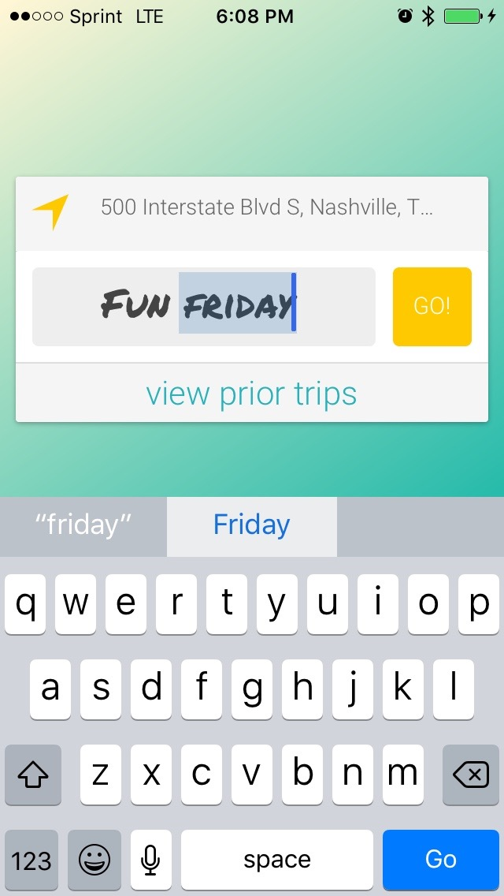
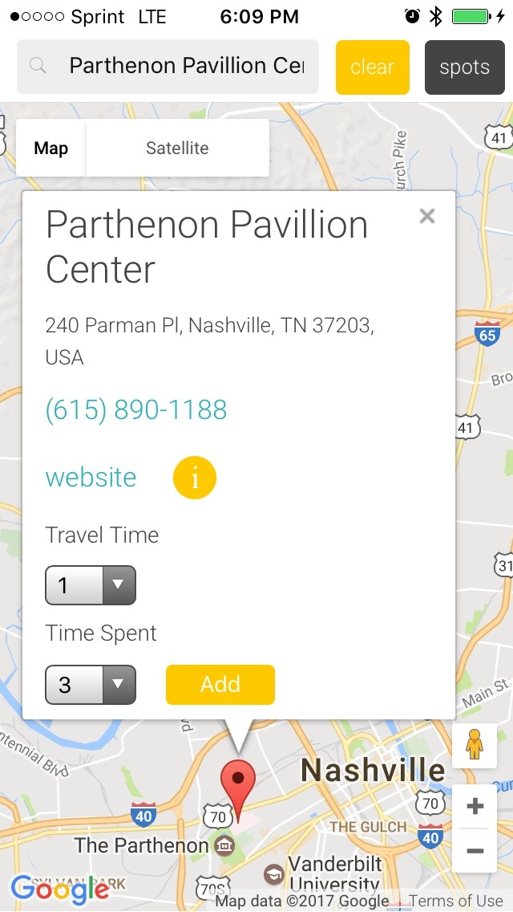
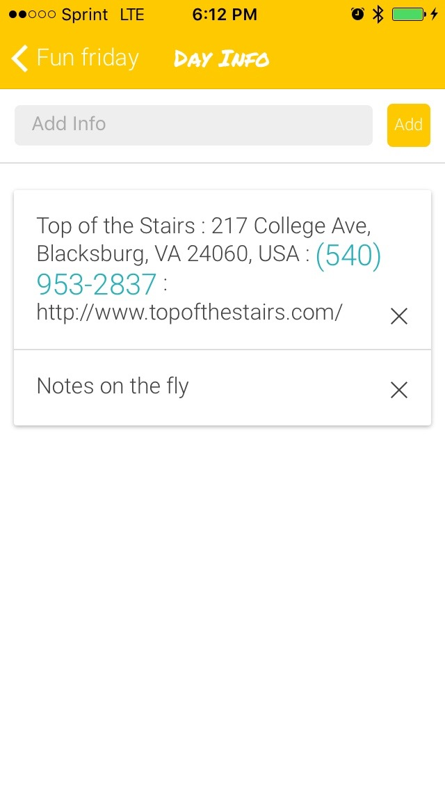
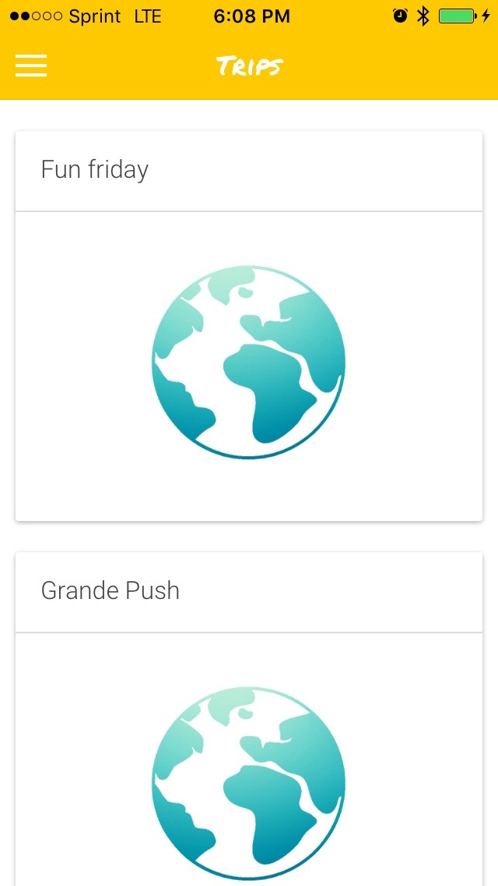

# Nomad V1
Nomad is a resource that a traveler can use on the go to optimize a travel experience in an unfamiliar area.
The mobile device sends current location to Google Maps API, allows them to select local points of interest from the Google Places Library, and returns a calculation of total time travel against time spent at a location.
Uses Ionic as mobile client to enable planning and discovery no matter the user is located.
Firebase authenticates users and stores data

# Moqups

